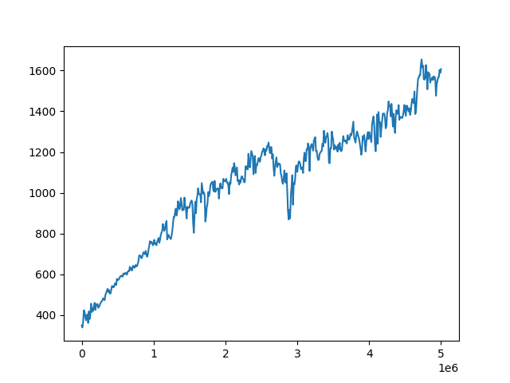
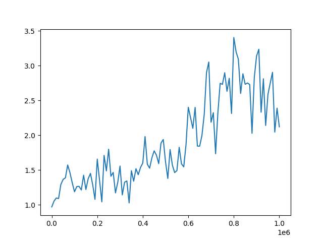
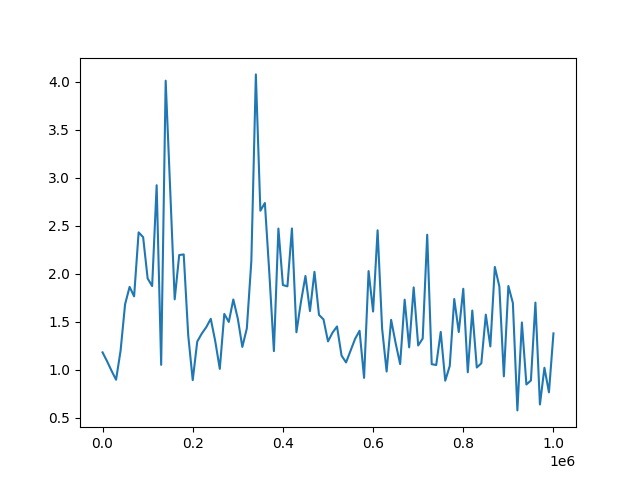
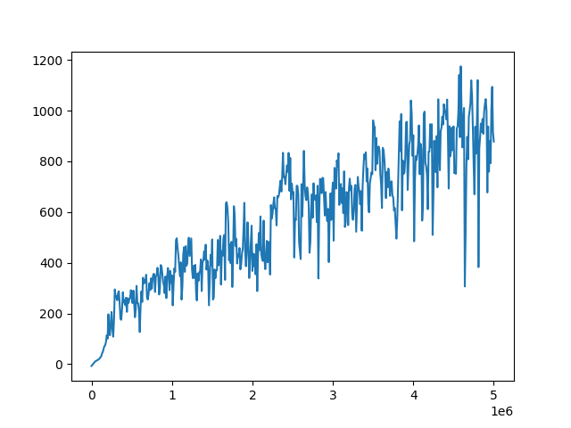
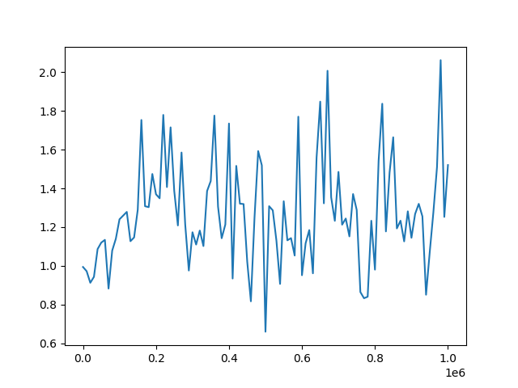
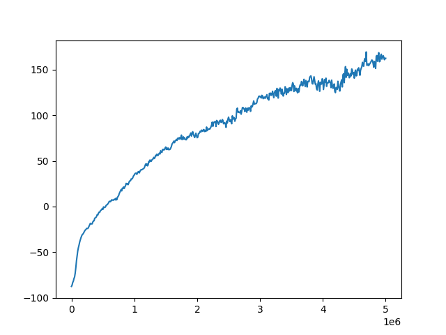
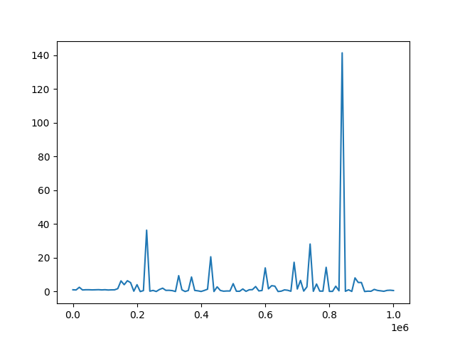

# Reward Surfaces

This project attempts to apply the methods of empirical numerical optimization to reinforcment learning.

## Introduction

Reinforcment learning has not yet been studied as a numerical optimization problem. We hope to change that.

### The episodic reinforcement learning problem

Recall that ultimately, the objective of optimal control which reinforcment learning tries to solve is a simple optimization problem. Maximize the sum of rewards in the episodic trajectory, typically denoted:

$$ J(\theta) = \sum_t R_t $$


### Numeric optimization

The field of numeric optimization studies how to most quickly optimize an objective given certain assumptions. Unfortunately, most of the assumptions that traditional numeric optimization makes do not hold for neural network optimization. So empirical methods are needed to study which properties a given optimization problem has and what those properties imply about the best method to solve it.

### Loss Landscapes

Loss landscapes are a simple method to visualize an optimization landscape. Typically, this is done by projecting the optimization domain to a small space around a point in the full, high dimentional optimization landscape, and visualizing that point. This method was successfully refined to understand properties of neural networks by [Li et. al.](https://arxiv.org/abs/1712.09913). They successfully identified many qualitative attributes of these local, low dimentional visualizations, and argued that these characteristics affected learning performance and stability.

### Reward landscapes for Reinforcment Learning

We hoped to similarly adapt the technique of low dimentional optimization landscape visualization to reinforcment learning.

## Experiments

### Visualizing landscape around trained models

At first, we hoped to just use the techniques used for analyzing loss landscapes in neural networks and apply them directly to reinforcement learning.
In this first experiment, trained models were taken from [RL baselines zoo](https://github.com/araffin/rl-baselines-zoo) to use as the central points in the local visualization.
Filter normalized random directions (suggested by [Li et. al.](https://arxiv.org/abs/1712.09913)) was used to project the parameters onto a 2 dimentional space. The 3rd dimention was an objective.

We plotted a number of these visualizations for a number of environments and reinforcment learning methods in [stable baselines](https://github.com/hill-a/stable-baselines).

The following visualization plots the average episodic reward in the atari BeamRider environment. The objective is plotted vs two random normalized directions (the axis labels should be ignored). The center point is evaluated on the pretrained model learned with A2C, every other point is an offset off that model.


Note that the average episodic reward is not necessarily the objective, due to discounting. Instead, the discounted average step return is perhaps a more true objective of the learning algorithm. This plot for BeamRider and A2C is shown below


As you can tell, this plot is very similar, but has a different Y axis, and also is shaped a bit differently, because it is a bit smoother.

Now, in RL, an agent estimates its future value. One interesting question is how does this estimate of its future value change when its policy parameters change randomly? Now, each state has a distict estimate. So in order to plot the parameters vs the estimated value, the value is averaged over all states the agent reaches. In other words, this is the agent's average estimate of its current value. One interesting (but possibly misleading) interpretation is that this is the agent's estimate of its average value. This interpretation is misleading because an RL agent is not trained to estimate its average value, and it is also not typically optimizing its estimate of its average value. None the less, these plots are deeply strange looking.


A table of these plots for various environments trained with A2C is shown below:

Environment | Averate Total Episodic Return | Mean Return | Mean estimate of value
--- | --- | --- | ---
Beam rider (shown above) |  |  | 
Breakout |  |  | 
Enduro |  |  | 
MsPacman |  |  | 
Pong |  |  | 

And the same environments, but trained with PPO:

Environment | Averate Total Episodic Return | Mean Return | Mean estimate of value
--- | --- | --- | ---
Beam rider (shown above) |  |  | 
Breakout |  |  | 
Enduro |  |  | 
MsPacman |  |  | 
Pong |  |  | 

Interestingly, in the two tables above, even though one is trained with PPO, and the other with A2C, which have slightly different objectives and learning dynamics, the broad shape of the reward surface is similar (with the notable exception of Enduro, which suffered from policy collapse when training on Enduro with A2C).


All of the plots are stored [here](https://github.com/benblack769/old-reward-surfaces/tree/main/vis) in the github repo for the old loss landscapes codebase.

### Visualizing surfaces over training

One of our core objectives is to understand learning instability in reinforcment learning. In particular, why RL is sometimes stable and sometimes unstable?

To study this, we visualized the landscape over training. To do this, a [thorough codebase](https://github.com/benblack769/reward-surfaces) with builtin reproducible00 visualizations was created to learn and evaluate reinforcment learning problems using [Stable baselines 3](https://stable-baselines3.readthedocs.io/en/master/#) and [Kaixhin's Rainbow DQN implementation](https://github.com/Kaixhin/Rainbow).


The following gif visualizes the average return of the HalfCheetah pybullet environment as trained over 1 million timesteps by PPO (using original PPO hyperparameters from paper).


Code to create gif:

```
python scripts/train_agent.py ./half_cheetah_checkpoints 1000000 SB3_ON HalfCheetahPyBulletEnv-v0 cpu '{"ALGO": "PPO", "num_envs": 1, "n_epochs": 1, "gamma": 0.99, "gae_lambda": 0.95, "clip_range": 0.2, "ent_coef": 0.0, "vf_coef": 0.5, "max_grad_norm": 0.5, "learning_rate": 0.0003, "batch_size": 64}' --save_freq=10000
python scripts/generate_gif_jobs.py --device=cpu --num-episodes=200 --seed=42 --magnitude=0.8 --grid-size=31 ./half_cheetah_checkpoints ./half_cheetah_gif_results
# consider replacing with scripts/run_jobs_slurm if you are running on a cluster.
python scripts/run_jobs_multiproc.py ./half_cheetah_gif_results/all_jobs.sh
python scripts/plot_gif.py ./half_cheetah_gif_results --outname=half_cheetah_ppo_training.gif
# resulting gif will be stored in half_cheetah_ppo_training.gif
```

While interesting, this gif was very expensive to compute (about a CPU year, or several days fully utilizing a 30 node cluster).

So another visualization was created that plots a random direction on one axis and the time across another.

For example, below is InvertedDoublePendulumPyBulletEnv environment trained with SAC over its 1 million training steps and showing different random directions at each time step (ignore the part of the image where it says "Gradient step size". That should be "Random offset").


Code to generate this plot:

```
mkdir train eval_line
python scripts/train_agent.py train/inv_double_pendulum 1000000 SB3_OFF InvertedDoublePendulumPyBulletEnv-v0 cuda ' {"ALGO": "SAC", "policy_kwargs": {"net_arch": [256, 256]}}' --save_freq=10000
python scripts/eval_line_segment.py train/inv_double_pendulum/ None eval_line/inv_double_pendulum/ --num-episodes=50 --random-dir-seed=42 --device=cpu --length=20 --max-magnitude=0.4 --scale-dir
python scripts/run_jobs_multiproc.py eval_line/inv_double_pendulum/jobs.sh
python scripts/job_results_to_csv.py eval_line/inv_double_pendulum/
python scripts/plot_eval_line_segement.py eval_line/inv_double_pendulum/results.csv inv_double_pendulum_lines.png
```

This plot shows that some directions at some points in training are very sensitive to noise. We know this because the plot shows that movement in some random directions will result in a striking decrease in performance. This is a strong argument for trust region based methods, which keep performance from falling too far in a single update.

However, other environments give very different looking results in this experiment:

Environment | Plot | Notable features
--- | --- | ---
InvertedDoublePendulum (above) |  | Sudden dropoffs encountered in a mostly flat surface.
Ant |  | Moving in random directions does not lead to clear gains or losses, rather the landscape is dominated by small wiggles in performance. This might make training difficult as there may be lots of local "canyons" in the optimization surface.
Hopper |  | Hopper becomes more sensitive to noise as training continues. This indicates the development of an increasingly fragile policy.


### Investigating the gradient direction

While random directions are useful for understanding learning stability under noisy updates, examining the gradient direction specifically might be able to highlight deficiencies in naïve policy gradient ascent that can be rectified with better RL methods.

We visualized the gradient by plotting the gradient vs a random direction.

Here is a diagram explaining the plots:


Here is a plot of the surface of the Hopper environment trained for 32000 timesteps using PPO:


Interestingly, while the gradient direction is the fastest direction to improve performance from the center, as expected, the absolute best direction is not in the direction of the gradient, because traveling too far in the gradient direction results in a steep dropoff in performance.

Code to generate this plot, and many others is in [this ipython notebook](https://github.com/benblack769/reward-surfaces/blob/master/demo/optimization_issues_rand.ipynb).


In order to more easily see how this gradient direction changes over training, we used the earlier visualization of direction vs training time, except this uses the unnormalized gradient.

For example, below is InvertedDoublePendulumPyBulletEnv environment trained with SAC over its 1 million training steps and showing the gradient direction at each time step. Note that at different timesteps, the surface, and therefore the gradient direction, will be differnet.


Code to generate this plot:

```
mkdir train eval_line eval_grad
python scripts/train_agent.py train/inv_double_pendulum 1000000 SB3_OFF InvertedDoublePendulumPyBulletEnv-v0 cuda ' {"ALGO": "SAC", "policy_kwargs": {"net_arch": [256, 256]}}' --save_freq=10000
python scripts/generate_eval_jobs.py --calc-grad --num-steps=1000000 ./train/inv_double_pendulum/ ./eval_grad/inv_double_pendulum/
python scripts/eval_line_segment.py train/inv_double_pendulum/ ./eval_grad/inv_double_pendulum/ eval_line/inv_double_pendulum/ --num-episodes=50 --device=cpu --length=15 --max-magnitude=1.0 --scale-dir
python scripts/run_jobs_multiproc.py eval_line/inv_double_pendulum/jobs.sh
python scripts/job_results_to_csv.py eval_line/inv_double_pendulum/
python scripts/plot_eval_line_segement.py eval_line/inv_double_pendulum/results.csv inv_double_pendulum_lines.png
```

This plot shows that updating in the gradient direction can be dangerous as well as beneficial. If a gradient update goes too far in the wrong part of the surface, there can be a catastrophic collapse in performance.

Other environments give very different looking results in this experiment:

Environment | Plot | Notable features
--- | --- | ---
InvertedDoublePendulum (above) |  | Sudden dropoffs encountered in a mostly flat surface.
Ant |  | Moving in the gradient direction does not lead to clear gains or losses (after the initial gains), rather the landscape is dominated by small wiggles in performance. This might make training
Hopper |  | Sudden droppoff, smooth droppoffs, and no dropoffs are all present.


### Sharp edges in reward surface


One of the key insights from visualizing the gradient direction is that there is a steep dropoff in performance if you travel too far along the gradient direction. Perhaps how close this dropoff is indicates how big of a learning step is appropriate, and so it may have implications about the learning speed of any gradient descent method.

To study this question, we perform a line search to find the distance to travel along the gradient so that the at which the value is the same as the original value. Note that if the point is at a local maximum, this distance will be 0 and it is at a global minimum, it may be infinite.


To compare how this metric relates to training, I show the training curve and the reward curve side by side.

Environment | Episodic Rewards | Maximum learning rate
--- | --- | ---
Hopper |  | 
Ant |  | 
HalfCheetah |  | 
InvertedDoublePendulum |  | 

Code to generate the plots with Hopper specifically is:

```
mkdir train eval_line eval_reward eval_grad
python scripts/train_agent.py train/hopper 1000000 SB3_OFF InvertedDoublePendulumPyBulletEnv-v0 cuda ' {"ALGO": "SAC", "policy_kwargs": {"net_arch": [256, 256]}}' --save_freq=10000
python scripts/generate_eval_jobs.py --calc-grad --num-steps=1000000 ./train/hopper/ ./eval_grad/hopper/
python scripts/grad_search_experiment.py --episode-rewards=200 --device=cpu --tolerance=0.05 ./train/hopper/ ./eval_grad/hopper/  ./eval_line/hopper/
python scripts/run_jobs_multiproc.py ./eval_line/hopper/jobs.sh
python scripts/job_results_to_csv.py ./eval_line/hopper/
python scripts/plot_traj.py  ./eval_line/hopper/results.csv --log-plot

# generate training curve plot
python scripts/generate_eval_jobs.py --num-episodes=200 ./train/hopper/ ./eval_reward/hopper/
python scripts/run_jobs_multiproc.py ./eval_reward/hopper/jobs.sh
python scripts/job_results_to_csv.py ./eval_reward/hopper/
python scripts/plot_traj.py  ./eval_reward/hopper/results.csv
```


### Investigating curvature of surfaces

One of the key assumptions of gradient ascent optimization (and most improvements upon it) is convexity. While neural networks are not globally convex, optimization is often dominated by locally convex features, which makes learning efficient despite global non-convexity. One measure of local convexity is to what degree a point has curvature in the wrong direction. To investigate questions about the nature of this non-convexity, the we derived an algorithm to estimate the hessian-vector product. Then standard tools were to estimate the minimum and maximum eigenvalues of the estimate of the hessian. A PDF with formal mathematical derivation is included [here](https://github.com/benblack769/reward-surfaces/raw/master/docs/mathnotes/main.pdf).

In order to understand the significance of this curvature, the associated eigenvectors of the minimum and maximum eigenvalues were found and plotted.

Here is the plot of the estimates of the minimum and maximum eigenvectors vs average total reward in the Hopper environment trained with PPO for 4000 timesteps. As you can tell, there is visible significant concavity and convexity. Having significant curvature in the wrong direction means that the gradient can step in the opposite direction from the local minimal, theoretically slowing down learning greatly.


Code to generate plot:

```
python scripts/train_agent.py ./hopper_checkpoints 1000000 SB3_ON HopperPyBulletEnv-v0 cpu '{"ALGO": "PPO", "num_envs": 1, "n_epochs": 1, "gamma": 0.99, "gae_lambda": 0.95, "clip_range": 0.2, "ent_coef": 0.0, "vf_coef": 0.5, "max_grad_norm": 0.5, "learning_rate": 0.0003, "batch_size": 64}' --save_freq=10000
python scripts/generate_eval_jobs.py --calc-hesh --num-steps=1000000 ./hopper_checkpoints/ ./hopper_eig_vecs/
python scripts/generate_plane_jobs.py --dir1=./hopper_eig_vecs/results/0040000/mineigvec.npz --dir2=./hopper_eig_vecs/results/0040000/mineigvec.npz --grid-size=31 --magnitude=1.0 --num-steps=200000   ./hopper_checkpoints/ ./hopper_eig_vecs_plane/
python scripts/run_jobs_multiproc.py ./hopper_eig_vecs_plane/jobs.sh
python scripts/job_results_to_csv.py ./hopper_eig_vecs_plane/
python scripts/plot_plane.py ./hopper_eig_vecs_plane/results.csv --outname=curvature_plot.png
```

### Estimating the local curvature of RL objective surfaces

One question of interest is to what degree are these locally non-convex surfaces are present in reward surfaces during training. If we can measure this local non-convexity, then perhaps we can correlate this measure with learning behavior. If there is some strong connection between local non-convexity and learning behavior, then that could inspire some better RL methods for dealing with the problem of local non-convexity, or for better exploiting convexity when it is present.

First, we need a metric for local non-convexity. The Loss Landscapes paper suggests such a metric in "A note of caution: Are we really seeing convexity?".
This metric is very simple. An optimization surface is locally convex if it is curved upwards in every direction, i.e. all the eigenvalues of the hessian are non-negative. Negative eigenvalues are indicative of concavity, or non-convexity. Note that typically, optimization is dominated by the largest magnitude eigenvalues.

This intuition inspires the following metric of non-convexity:

$$ \text{Local Non-convexity} = -\tfrac{\max(0,e_\min)}{e_\max}) $$

Where $e_\min$ and $e_\max$ are the minimum and maximum eigenvalues of the Hessian.

Note that since RL is a maximization problem, as opposed to a minimization problem, this ratio measures convexity, not non-convexity. So higher values are better.

$$ \text{Local Convexity for RL} = -\tfrac{e_\max}{e_\min}) $$

Unfortunately, estimating the eigenvalues of the Hessian as described in section 4 of the [derivation document](https://github.com/benblack769/reward-surfaces/raw/master/docs/mathnotes/main.pdf) is a noisy, and not necessarily unbiased process (the hessian estimation is unbiased, but not the eigenvalue estimation). This means that sampling eigenvalues multiple times may not lead to convergence to the true eigenvalues. It also means that error bounds on the eigenvalue estimates are hard to generate. So specific values of the plots below should be taken with a grain of salt. However, broad trends in the plots most likely are not due to algorithmic bias, but due to real changes in the optimization surface.

In the plots below, the X axis is training steps. The Y axis on the episodic reward plots is episodic reward. The Y axis on the convexity plots is convexity.

Environment | Episodic reward over training | Convexity over training
--- | --- | ---
Ant |  | 
Hopper |  | 
Half Cheetah |  | 
Humanoid |  | 


<!-- -->
